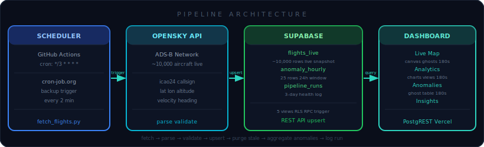
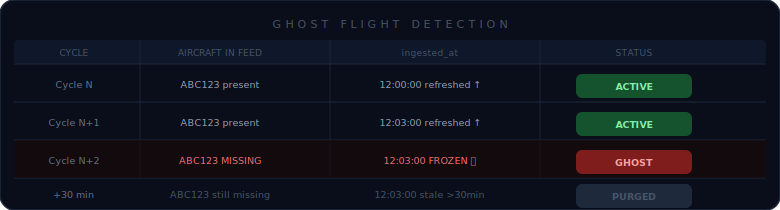
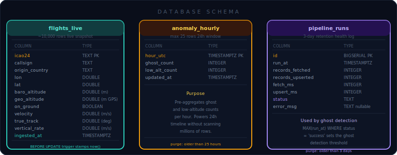
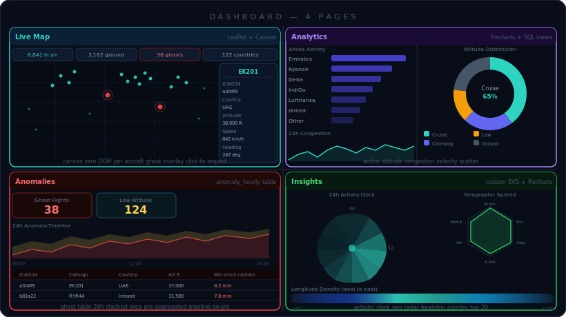

<div align="center">

<svg xmlns="http://www.w3.org/2000/svg" viewBox="0 0 720 140" width="720" height="140">
  <defs>
    <linearGradient id="hbg" x1="0%" y1="0%" x2="100%" y2="0%">
      <stop offset="0%" style="stop-color:#0A0E1A"/>
      <stop offset="100%" style="stop-color:#0F1624"/>
    </linearGradient>
    <linearGradient id="hacc" x1="0%" y1="0%" x2="100%" y2="0%">
      <stop offset="0%" style="stop-color:#2DD4BF"/>
      <stop offset="100%" style="stop-color:#2563EB"/>
    </linearGradient>
  </defs>
  <rect width="720" height="140" rx="14" fill="url(#hbg)"/>
  <rect width="720" height="140" rx="14" fill="none" stroke="#1C2A40" stroke-width="1"/>
  <line x1="0" y1="70" x2="720" y2="70" stroke="#1C2A40" stroke-width="0.5"/>
  <line x1="360" y1="0" x2="360" y2="140" stroke="#1C2A40" stroke-width="0.5"/>
  <text x="65" y="82" font-size="48" text-anchor="middle" dominant-baseline="middle">&#9992;</text>
  <text x="120" y="55" font-family="monospace" font-size="36" font-weight="bold" fill="url(#hacc)">FlightPulse</text>
  <text x="120" y="90" font-family="monospace" font-size="13" fill="#64748B" letter-spacing="10">G L O B A L</text>
  <text x="570" y="52" font-family="monospace" font-size="11" fill="#2DD4BF" text-anchor="middle">REAL-TIME</text>
  <text x="570" y="72" font-family="monospace" font-size="11" fill="#64748B" text-anchor="middle">FLIGHT INTELLIGENCE</text>
  <text x="570" y="92" font-family="monospace" font-size="10" fill="#475569" text-anchor="middle">10,000+ aircraft live</text>
  <circle cx="655" cy="48" r="6" fill="#2DD4BF" opacity="0.95"/>
  <circle cx="655" cy="48" r="12" fill="none" stroke="#2DD4BF" stroke-width="1.2" opacity="0.4"/>
  <circle cx="655" cy="48" r="19" fill="none" stroke="#2DD4BF" stroke-width="0.6" opacity="0.18"/>
</svg>

<br/>


**Real-time global flight tracking dashboard — ingests live ADS-B transponder data from 10,000+ aircraft every 3 minutes, detects anomalies, and visualises everything in a dark-themed SOC-style interface.**

[**Live Demo**](https://flight--pulse.vercel.app) &nbsp;·&nbsp; [Features](#-features) &nbsp;·&nbsp; [Architecture](#-architecture) &nbsp;·&nbsp; [Dashboard](#-dashboard-pages) &nbsp;·&nbsp; [Setup](#-setup)

</div>

---

## ✨ Features

<table>
<tr>
<td width="50%" valign="top">

### 🗺️ Live Map
Canvas-rendered world map — scales to 10,000+ aircraft without frame drops.
- Aircraft rotated by true heading, sized by altitude band
- **Ghost flights** pulsing red — vanished transponders detected automatically
- Click any aircraft: ICAO24, callsign, country, altitude, speed, heading, vertical rate
- Stats bar: flights in air, on ground, ghost count, active countries

</td>
<td width="50%" valign="top">

### 📊 Analytics
Four charts built entirely from PostgreSQL views — no client-side aggregation.
- **Airline activity** bar chart — Emirates, Ryanair, Delta, IndiGo, Lufthansa & more
- **Altitude distribution** donut — Ground / Low / Climbing / Cruise / High Alt
- **24h congestion** area chart — average flights per hour from pipeline history
- **Velocity scatter** — speed vs altitude across all live airborne flights

</td>
</tr>
<tr>
<td width="50%" valign="top">

### 🚨 Anomalies
Pre-aggregated anomaly tracking — no expensive history table scans.
- **Ghost flight table** — paginated, sortable list of aircraft with stale signals
- **24h stacked area** — ghost count + low-altitude count per hour
- Powered by `anomaly_hourly` (max 25 rows) updated each pipeline cycle
- Suppresses false alerts automatically when the pipeline is offline

</td>
<td width="50%" valign="top">

### 🌍 Insights
Four custom visualisations built with Recharts and hand-crafted SVG.
- **24h activity clock** — radial chart mapping air traffic congestion by hour
- **Longitude density heatstrip** — east/west flight concentration across 360°
- **Geographic spread radar** — 8-region radar chart (N. America, Europe, Asia-Pac, Mid-East, S. America, Africa, Oceania, Russia-CIS)
- **Country leaderboard** — top 20 active origin countries

</td>
</tr>
</table>

---

## 🏗️ Architecture

<div align="center">

</div>

<br/>

| Step | What happens |
|---|---|
| **1. Trigger** | GitHub Actions fires `*/3 * * * *`. cron-job.org sends a `workflow_dispatch` every 2 min as a reliability backup — GitHub's scheduler can delay 10–30 min. |
| **2. Fetch** | `fetch_flights.py` requests all live state vectors from the OpenSky Network API. Returns ~10,000 rows of raw ADS-B data. Falls back to anonymous mode if OAuth2 is unreachable. |
| **3. Parse & Validate** | Each state vector is validated — airborne flights with missing lat/lon are rejected; ICAO24 is normalised to lowercase hex. |
| **4. Upsert** | All valid records are `POST`ed to Supabase REST API in 1,000-row chunks with `Prefer: resolution=merge-duplicates`. A `BEFORE UPDATE` trigger stamps `ingested_at = now()` on every row. |
| **5. Cleanup** | `purge_stale_live()` removes rows unseen for 30+ min. `upsert_anomaly_hourly()` updates this hour's ghost + low-alt counts. `log_run()` records timing and status. |

---

### Ghost Flight Detection

<div align="center">

</div>

<br/>

> Aircraft are flagged as ghosts by comparing `ingested_at` against the **last successful pipeline run** timestamp — not against `now()`. This eliminates false positives during the normal gap between fetches. A flight is only a ghost if it was absent from the OpenSky feed in that specific run.

```sql
-- ghost_flights view logic
WHERE ingested_at < (
  SELECT MAX(run_at) - INTERVAL '30 seconds'
  FROM pipeline_runs WHERE status = 'success'
)
```

---

## 🗄️ Database Schema

<div align="center">

</div>

<br/>

**Views** computed on the tables (zero extra storage):

| View | What it returns |
|---|---|
| `airline_activity` | Airborne flight count per airline, identified by callsign prefix |
| `altitude_distribution` | Flight counts bucketed into Ground / Low / Climbing / Cruise / High Alt |
| `country_activity` | Top 20 origin countries by live airborne count |
| `ghost_flights` | Aircraft absent from the last pipeline run, with minutes since contact |
| `dashboard_stats` | Single-row summary: in-air, ground, ghosts, countries, seconds since last sync |

**RPC:** `get_hourly_congestion()` — 24 rows of average flights per hour for the congestion chart.

---

## 📱 Dashboard Pages

<div align="center">

</div>

<br/>

| Page | Route | Charts | Data source | Refresh |
|---|---|---|---|---|
| **Live Map** | `/` | Canvas map, ghost overlay, stat bar, click card | `flights_live`, `ghost_flights`, `dashboard_stats` | 180s map / 60s stats |
| **Analytics** | `/analytics` | Airline bars, altitude donut, congestion area, velocity scatter | `airline_activity`, `altitude_distribution`, `get_hourly_congestion()`, `flights_live` | 180s |
| **Anomalies** | `/anomalies` | Ghost stat card, 24h stacked area, ghost table | `anomaly_hourly`, `ghost_flights` | 180s |
| **Insights** | `/insights` | Activity clock, geo radar, longitude heatstrip, country leaderboard | `country_activity`, `flights_live` | 180s |

---

## 🛠️ Tech Stack

| Layer | Technology | Role |
|---|---|---|
| **Frontend** | React 18 + Vite 6 | SPA with fast HMR builds |
| **Styling** | Tailwind CSS 3 | Dark SOC-style theme |
| **Map** | Leaflet 1.9 + Canvas layer | Zero DOM nodes per aircraft |
| **Charts** | Recharts + custom SVG | Area, scatter, donut, radar, clock charts |
| **Database** | Supabase (PostgreSQL 15) | PostgREST, RLS, views, triggers, RPC |
| **Ingestion** | Python 3.11 + pg8000 | Validates data, upserts via Supabase REST API |
| **Scheduler** | GitHub Actions cron | `*/3 * * * *` — runs `fetch_flights.py` |
| **Backup trigger** | cron-job.org | Fires `workflow_dispatch` every 2 min for reliability |
| **Deploy** | Vercel | Auto-deploys on every push to `master` |
| **Data source** | OpenSky Network | Community ADS-B receiver network, global coverage |

---

## 🚀 Setup

### 1 — Supabase

1. Create a project at [supabase.com](https://supabase.com)
2. **SQL Editor** → paste and run `supabase/reset_database.sql`
3. **Settings → API → Max Rows** → set to `10000`

---

### 2 — GitHub Actions

Make the repo **public**, then add secrets under **Settings → Secrets and variables → Actions**:

| Secret | Where to find it |
|---|---|
| `DATABASE_URL` | Supabase → Settings → Database → **Transaction mode URI** (port 6543) |
| `SUPABASE_SERVICE_KEY` | Supabase → Settings → API → `service_role` key |
| `OPENSKY_CLIENT_ID` | opensky-network.org → Account → API Credentials |
| `OPENSKY_CLIENT_SECRET` | opensky-network.org → Account → API Credentials |

Push to GitHub — `.github/workflows/ingest.yml` runs automatically.

> GitHub pauses scheduled workflows after **60 days of repo inactivity**. A single commit reactivates them.

---

### 3 — cron-job.org (recommended)

GitHub's built-in scheduler can delay 10–30 minutes. An external trigger keeps the pipeline running on time.

1. Sign up at [cron-job.org](https://cron-job.org)
2. Create a cron job:
   - **URL:** `https://api.github.com/repos/YOUR_USERNAME/Flight-Pulse/actions/workflows/ingest.yml/dispatches`
   - **Method:** `POST`
   - **Headers:** `Authorization: Bearer YOUR_GITHUB_PAT` and `Accept: application/vnd.github+json`
   - **Body:** `{"ref":"master"}`
   - **Schedule:** Every 2 minutes

---

### 4 — Vercel

```bash
npm i -g vercel
vercel --prod
```

Add environment variables in the Vercel dashboard:

```
VITE_SUPABASE_URL      = https://xxxx.supabase.co
VITE_SUPABASE_ANON_KEY = eyJ...
```

---

### Local Development

```bash
# Clone and install
git clone https://github.com/Mukesh7522/Flight-Pulse.git
cd Flight-Pulse
npm install

# Environment
cp .env.local.example .env.local
# Fill VITE_SUPABASE_URL and VITE_SUPABASE_ANON_KEY

# Start dev server
npm run dev   # → http://localhost:5173

# Run ingestion manually (optional)
cd ingestion
pip install -r requirements.txt
python fetch_flights.py
```

---

## 📁 Project Structure

```
Flight-Pulse/
├── .github/
│   └── workflows/
│       └── ingest.yml              ← cron: */3 * * * *  +  workflow_dispatch
│
├── docs/
│   ├── arch.svg                    ← architecture diagram
│   ├── ghost.svg                   ← ghost detection timeline
│   ├── schema.svg                  ← database schema
│   └── dashboard.svg               ← dashboard pages overview
│
├── ingestion/
│   ├── fetch_flights.py            ← fetch → validate → upsert → cleanup → log
│   └── requirements.txt
│
├── src/
│   ├── hooks/
│   │   ├── useFlightData.js        ← flights_live + ghost_flights + dashboard_stats
│   │   ├── useAnomalies.js         ← anomaly_hourly + ghost table data
│   │   ├── useAnalytics.js         ← airline_activity, altitude_distribution, RPC
│   │   └── usePipeline.js          ← pipeline health metrics
│   │
│   └── pages/
│       ├── LiveMap.jsx             ← canvas map, ghost overlay, click-to-inspect
│       ├── Analytics.jsx           ← airline bars, altitude donut, congestion, scatter
│       ├── Anomalies.jsx           ← ghost table, 24h stacked area chart
│       └── Insights.jsx            ← activity clock, radar, heatstrip, leaderboard
│
├── supabase/
│   └── reset_database.sql          ← full schema: tables, views, triggers, RLS, functions
│
├── package.json
└── vite.config.js
```

---

## 🔒 Security

- **Row Level Security** on all tables — public `SELECT`, no public write
- `VITE_SUPABASE_ANON_KEY` is safe in the browser — PostgREST enforces RLS on every query
- `DATABASE_URL` and `SUPABASE_SERVICE_KEY` live only in GitHub Secrets
- `.env.local` is gitignored — never committed

---

## ⏱️ Refresh Rates

| Data | Interval | Why |
|---|---|---|
| `flights_live` | 180s | Matches ingestion cadence — polling faster serves stale data |
| `ghost_flights` | 180s | Ghost status only changes when the pipeline runs |
| `dashboard_stats` | 60s | Stats counter refreshes 3× faster so the header feels live |
| `anomaly_hourly` | 180s | Updated once per pipeline cycle |
| Ingestion pipeline | ~180s | GitHub Actions cron + cron-job.org backup trigger |

---

## 🔧 Troubleshooting

| Symptom | Cause | Fix |
|---|---|---|
| **PIPELINE OFFLINE** | `ingested_at` not updated for over 1 hour | Check GitHub Actions → latest run → "Run ingestion" step for errors |
| **0 ghost alerts** | No `status = 'success'` rows in `pipeline_runs` | Pipeline must complete successfully for ghost detection to have a reference timestamp |
| **Actions green but no data** | `SUPABASE_SERVICE_KEY` missing from repo secrets | Add it under Settings → Secrets → Actions |
| **Ingestion times out on OpenSky** | OpenSky blocking the GitHub Actions IP range | Intermittent — script falls back gracefully and retries next cycle |
| **Scheduled workflow not running** | GitHub paused it after 60 days inactivity | Push any commit or trigger manually via Actions → Run workflow |
| **Ghost count spikes to thousands** | Views not updated after running old `reset_database.sql` | Re-run the latest `supabase/reset_database.sql` to get run-based ghost detection |

---

## 📈 Performance

- **Zero DOM nodes per aircraft** — Leaflet canvas layer redraws the full frame in ~2ms vs freezing with 10,000+ individual HTML elements
- **Server-side aggregation** — airline counts, altitude buckets, and country rankings are computed in PostgreSQL views; the frontend receives pre-grouped rows only
- **`anomaly_hourly` avoids history scans** — each pipeline cycle upserts a single row per hour (max 25 rows) rather than scanning millions of historical records
- **Chunked upserts** — 10,000+ rows split into 1,000-row HTTP POST requests to stay within Supabase limits and avoid timeouts

---

<div align="center">


*Flight data sourced from [OpenSky Network](https://opensky-network.org) — a community-driven ADS-B receiver network.*

</div>
